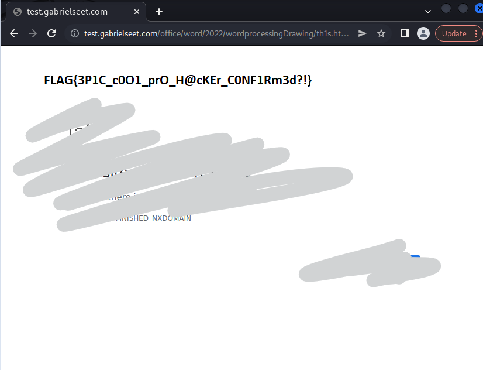

# **Homework_Answers**

### **Challenge**
John sent me his homework answers but its not very helpful, Could he be trying a new exploit on me again D:

<br>
<br>

#### **Creator**: Gabriel Seet


#### **Category:** Forensics


<br>

---

### **Solution**
We are given a .docx file to analyse, which is extremely super surprisingly flagged as malicious.

As such, I analysed the file with `Olevba` to check for any obfuscated malicious code/secrets in the file.

```console
┌──(root㉿kali)-[~]
└─# olevba --decode homework_answers.docx 
XLMMacroDeobfuscator: pywin32 is not installed (only is required if you want to use MS Excel)
olevba 0.60.1 on Python 3.10.5 - http://decalage.info/python/oletools
===============================================================================
FILE: homework_answers.docx
Type: OpenXML
No VBA or XLM macros found.
```

Hm. Surprisingly there are no flags that came up. The other choice I had was to unzip the file and see what information I can get.

<br>
<br>

```console
┌──(root㉿kali)-[~/Desktop]
└─# unzip homework_answers.docx -d homework        
Archive:  homework_answers.docx
  inflating: homework/[Content_Types].xml  
  inflating: homework/_rels/.rels    
  inflating: homework/docProps/app.xml  
  inflating: homework/docProps/core.xml  
   creating: homework/word/_rels/
  inflating: homework/word/_rels/document.xml.rels  
  inflating: homework/word/document.xml  
   creating: homework/word/embeddings/
  inflating: homework/word/embeddings/Microsoft_Excel_Chart.xls  
  inflating: homework/word/fontTable.xml  
   creating: homework/word/media/
  inflating: homework/word/media/image1.emf  
  inflating: homework/word/settings.xml  
  inflating: homework/word/styles.xml  
   creating: homework/word/theme/
  inflating: homework/word/theme/theme1.xml  
  inflating: homework/word/webSettings.xml 
```

There is a XML file included, so I unziped that too because the more the merrier I thought.

<br>
<br>

```
┌──(root㉿kali)-[~/Desktop/homework/word/embeddings]
└─# unzip Microsoft_Excel_Chart.xls        
Archive:  Microsoft_Excel_Chart.xls
warning [Microsoft_Excel_Chart.xls]:  51330 extra bytes at beginning or within zipfile
  (attempting to process anyway)
  inflating: [Content_Types].xml     
  inflating: _rels/.rels             
  inflating: theme/theme/themeManager.xml  
  inflating: theme/theme/theme1.xml  
  inflating: theme/theme/_rels/themeManager.xml.rels 
```
As a result, a .rels file was added to the _rels folder that was previously empty before.

<br>

The .rels file contains something peculiar....

> ```Target="https://test.gabrielseet.com/office/word/2022/wordprocessingDrawing/th1s.html!"```

<br>
<br>

Clicking on the link [Don't do this at home kids], I was brought to a page which had the flag!

<Br>



<br>
<br>


Flag:
> **FLAG{GODKNOWSWHATTHEFLAGACTUALLYIS}**
