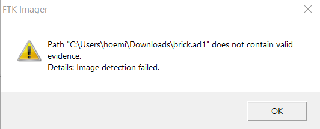
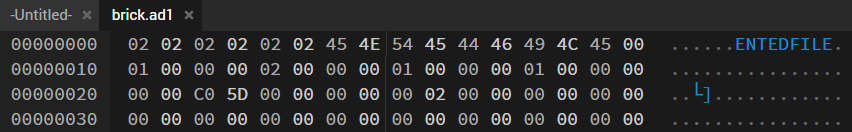
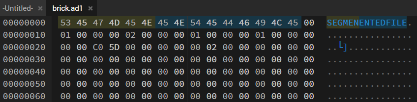
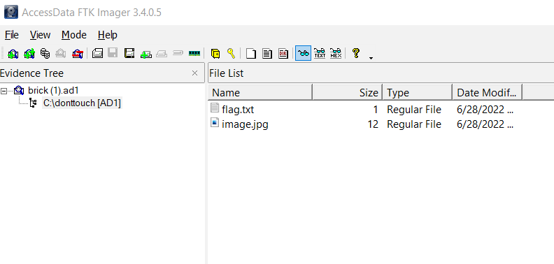
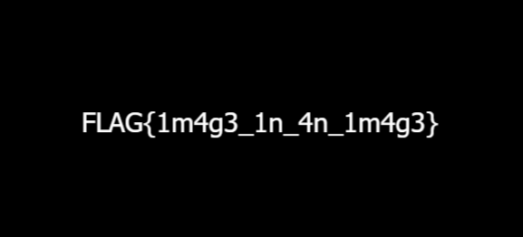

# **Seized**

### **Challenge**
We managed to extract this from our teacher's computer Can you find his secret files?

 
 

#### **Creator**: Gabriel Seet

#### **Category:** Forensics

 

---

### **Solution**
We are given two files, **brick.ad1** and **brick.ad1.txt**.

Given the file type, we can tell that it is an `image container file` and the challenge may have to do something with us opening the files to obtain the flag, using a `FTK imager`.

 

I'm using AccessData FTK imager for reference.

 
 

An error popped up when I was adding the ad1 file into the software: `Image detection failed`.

It probably wasn't going to be this easy. I'm guessing either the file is corrupted or something else is at play here.

 

Analysing the file with a binary file editor, we can see that the header is all messed up.

 

For reference, this is what a normal .ad1 file header should be:
"`53 45 47 4D 45 4E 45 4E 54 44 46 49 4C 45`"

 
 

Using the hex editor (In this case I'm using hexedit), I fixed the file header.

 

Now I am able to open the .ad1 file and view the content. The flag.txt was a bait, and the actual flag is hidden in the jpg file.

 
 

There she is!

Flag:
> **FLAG{1m4g3_1n_4n_1m4g3}**