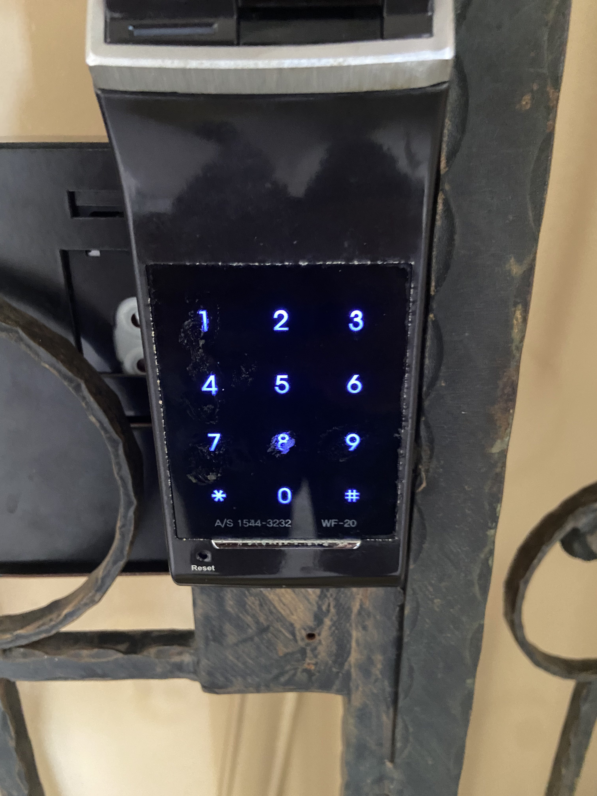

# **Physical Breakout**

### Challenge
"Finally! The Pentagon's vaccine works. However, they have a shortage of manpower to deliver the vaccine to the survivors. In order to get the vaccine, you have to enter their company through the main entrance. Can you guess the password to unlock the door?"

It is a 4 digit lock and 1 symbol

Flag Format NYP{pin}

Example NYP{1234!} (THIS IS NOT THE PIN JUST AN EXAMPLE)

> File: [lock.jpg](img/lock.jpg)

***

**Solution**

We were given this image to work with.

 

From the image, I could tell there were some wear on some of the digits.
The challenge description mentioned that the lock pin contains 4 digits and a symbol at the end.

Based on the wear, I guessed and deduced that it was 1478*

 > Flag:  **NYP{1478\*}**