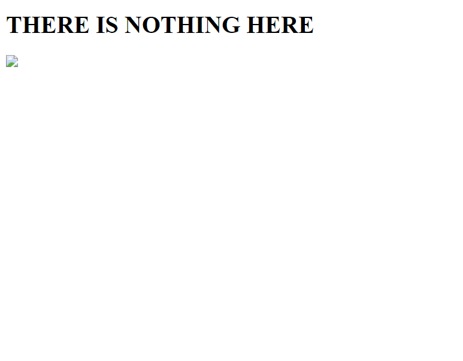
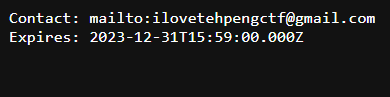
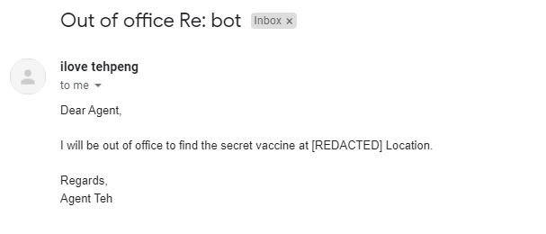
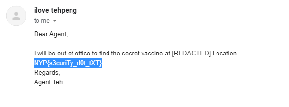

# **Secret Service**

### Challenge
"You received a text file from an EdOverflow and Yakok Shafranovich. What is inside? Does it come from other survivors?"

***

**Solution**

Opening the website, I was greeted to a page with nothing much in it.



The hint given in the challenge description talked about someone named "**EdOverflow**" and "**Yakok Shadranovich**".

A little bit of osint led me to this article:
https://www.securityweek.com/ietf-publishes-rfc-9116-securitytxt-file

The article talked about "**security.txt**" and "**/.well-known/**". Maybe we can type this in into the website.

<br>

```
https://secret.nypinfsecctf.tk/.well-known/security.txt
```

Entering the link above into the url gave me this:


<br>

We are given an email and some expiry date. Lets try emailing the email given.



it works! The bot replied us with an email with some info.

<br>



Upon closer inspection, it looks like the flag was in plain sight all along.

>Flag: **NYP{s3curiTy_d0t_tXT}**